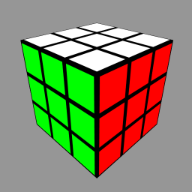

# webgl-rubiks-cube

This is an interactive Rubik's Cube, that uses a 3D renderer in the browser

## Built With:

- p5.js
- Vanilla Javascript

## Features:

- User Orbit/Pan
- Increasable order (e.g. 2x2, 3x3, 4x4, etc.)
- Animating Turns
- Auto scrambling and solving
- Keyboard and Button controls
- Multiple Graphics Options

